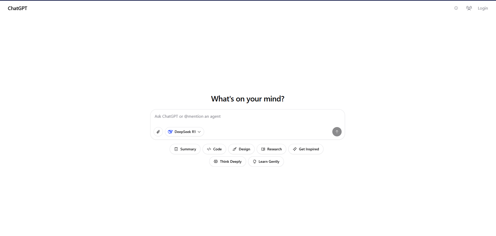

# 🤖 ChatGPT – Multi-Model AI Chat UI

Welcome to **ChatGPT**, a fully open-source, customizable, multi-model AI chat interface built with modern web technologies. Designed and maintained by [@mehdi-eti](https://github.com/mehdi-eti), this project is ideal for developers looking to self-host or build upon a powerful chat UI with support for various LLM providers.

🌐 **Live Demo:** [ChatGPT](https://regal-fenglisu-19f212.netlify.app)



---

## ✨ Features

- 🔄 **Multi-model support**: OpenAI, Claude, Gemini, and Mistral
- 📁 **File upload**: Drop files into the chat and get context-aware responses
- 🎨 **Modern UI**: Built with Tailwind CSS, shadcn/ui, and prompt-kit
- 🌓 **Dark/Light themes** with responsive design
- 🔧 **Fully customizable**: system prompts, layout modes, and user settings
- 🛠️ **Self-hostable** and production-ready

## 🧠 Agent Features (WIP)

- `@agent` mentions to invoke agent tools
- Foundation for tool usage and AI workflows
- MCP (Multi-Component Prompting) system (in progress)
- Modular architecture for advanced agent behavior

---

## 🚀 Getting Started

You can run ChatGPT locally in seconds — just plug in your OpenAI API key:

```bash
git clone https://github.com/mehdi-eti/ChatGPT.git
cd ChatGPT
npm install
echo "OPENAI_API_KEY=your-key" > .env.local
npm run dev
